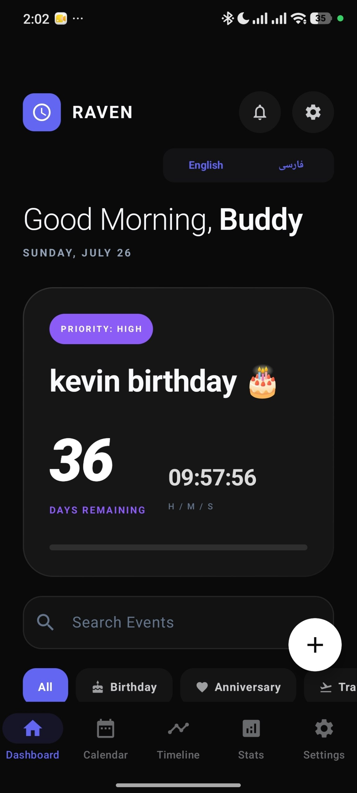
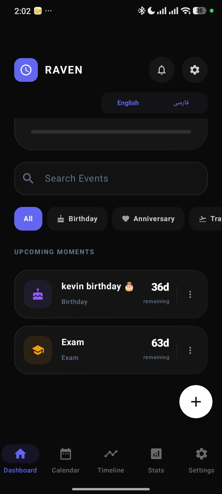
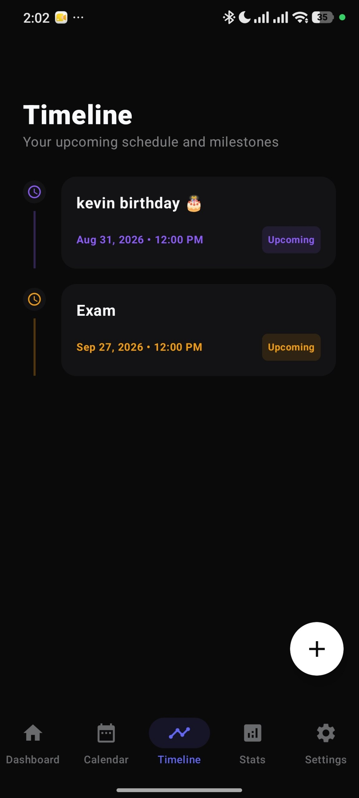
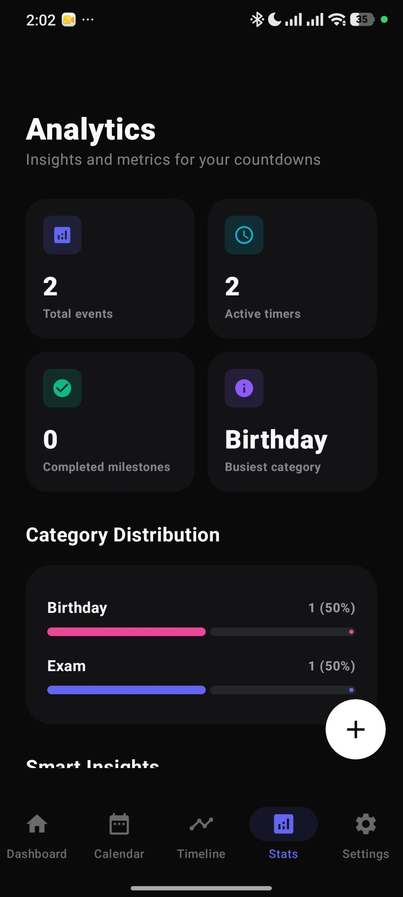
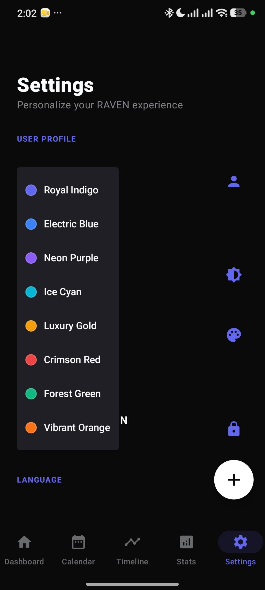
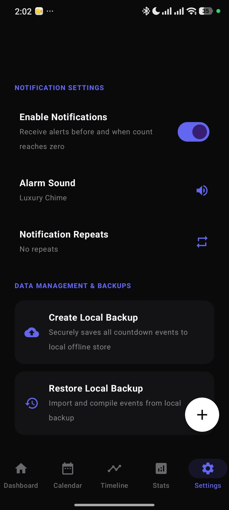
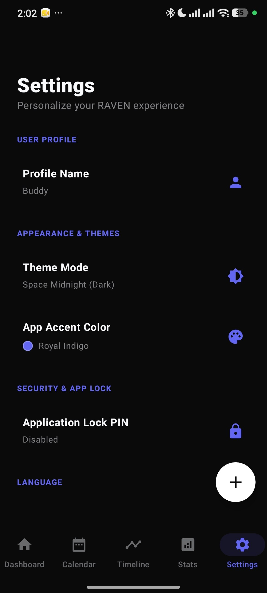
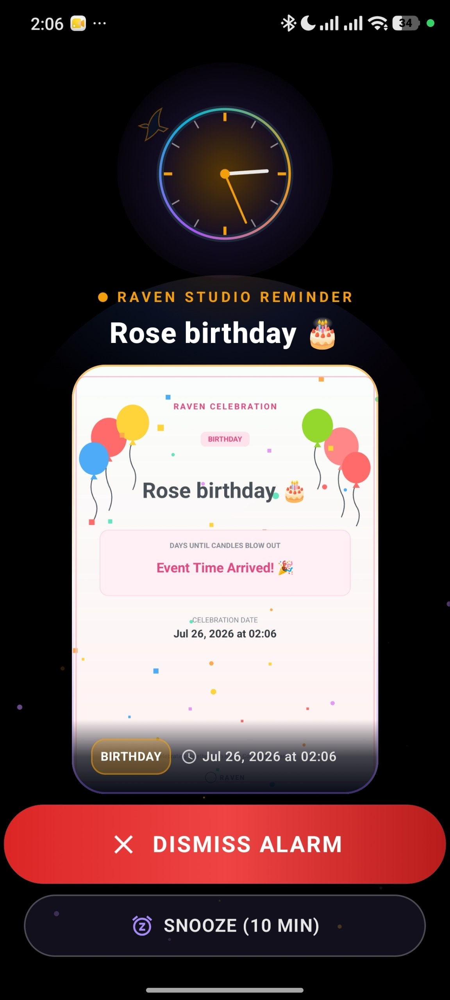
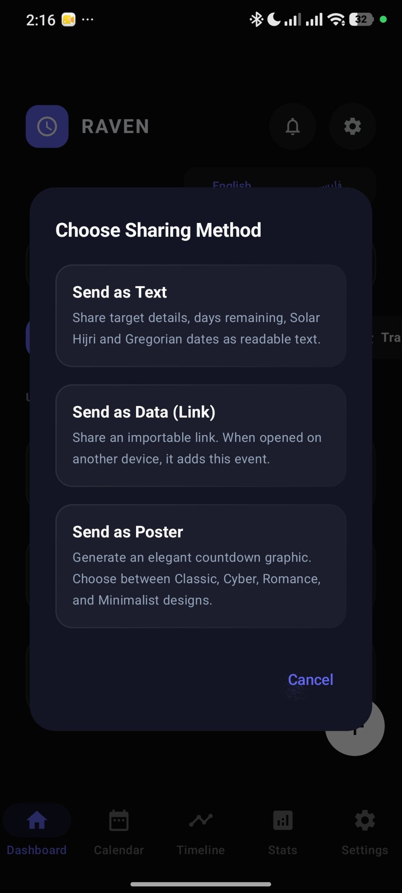

<h3 align="center">
🐦‍⬛ Smart Reminder & Countdown App
</h3>

A modern Android application designed to help you manage important moments, events, and reminders with a beautiful and personalized experience.

Built by <b>Raven Studio</b>

---

## ⏳ About RavenCountdown

RavenCountdown is a powerful reminder and countdown application for Android that helps users organize important events, create personalized reminders, and never miss meaningful moments.

With support for both Persian and Gregorian calendars, advanced customization options, smart notifications, and beautiful sharing features, RavenCountdown provides a complete time management experience.

---

# ✨ Features

## 📅 Dual Calendar System

RavenCountdown supports both Persian and Gregorian calendars, giving users complete flexibility when creating reminders.

- 🇮🇷 Persian (Jalali) calendar support
- 🌍 Gregorian calendar support
- ⏰ Precise time selection
- 📆 Create reminders based on any date system

---

## 🔔 Advanced Reminder System

Create powerful reminders for every important moment.

- ➕ Create personalized reminders
- ✏️ Edit reminders anytime
- 🗂️ Organize reminders with categories
- 🎨 Choose custom colors for reminders
- ⭐ Set reminder importance and sensitivity
- 🔁 Repeat reminders:
  - Daily
  - Weekly
  - Monthly
  - Yearly

---

## 🎨 Personalization & Customization

Make RavenCountdown match your personal style.

- 🌈 Multiple application themes
- 🎨 Advanced color customization
- 🖌️ Personalized reminder appearance
- ⚙️ Flexible settings system

---

## 🖼️ Smart Sharing Experience

Share your reminders in beautiful and creative ways.

RavenCountdown supports multiple sharing methods:

### 📝 Text Sharing

Share complete reminder information as text.

### 🔗 Link Sharing

Create shareable reminder links that can be imported directly into RavenCountdown.

### 🖼️ Poster Sharing

Generate beautiful reminder posters with different themes and designs.

---

## ⏰ Smart Notification Experience

Never miss an important moment.

- 🔔 Advanced reminder notifications
- 🔒 Lock screen alarm-style display
- 🖼️ Custom reminder posters
- 🎵 Dedicated reminder interface
- ✅ Quick actions to manage reminders

---

## 🔐 Privacy & Backup

Keep your personal reminders safe.

- 🔒 Application password protection
- 💾 Backup and restore system
- 🛡️ Privacy-focused design

---

## 🌍 Language Support

Available in multiple languages:

- 🇮🇷 Persian
- 🇬🇧 English

---
# 📸 Screenshots

Explore RavenCountdown's modern interface and powerful reminder features.

---

## ⏳ Main Experience

The main dashboard and countdown experience designed with simplicity and clarity.

---

## 📅 Calendar & Timeline

Manage important dates with calendar support and timeline organization.

---

## 📊 Statistics & Insights

Track your reminders and explore your activity through detailed statistics.

---

## 🎨 Settings & Customization

Customize RavenCountdown with advanced settings and personalization options.

---

## 🔔 Alarm Experience

A dedicated reminder interface designed to make sure you never miss important moments.

---
---

## 🎨 Customization & Themes

Personalize RavenCountdown with themes, colors, and advanced settings.

---

## 🖼️ Smart Sharing

Share your reminders with beautiful posters, links, or detailed text.

---

## 🔔 Reminder Alarm Experience

Experience reminders with a dedicated notification interface and lock screen style alarm.

---
# 🛠️ Built With

RavenCountdown is built using modern Android development technologies with a focus on performance, reliability, and a smooth user experience.

---

## 📱 Development Stack

### Android Development

- Kotlin
- Java
- Android SDK
- Android Studio

---

## 🎨 User Experience

RavenCountdown focuses on creating a beautiful and personalized experience through:

- Modern Android UI design
- Smooth interactions
- Advanced customization options
- User-focused design decisions

---

## 🔔 Core Systems

The application includes custom systems for:

- Reminder management
- Calendar handling
- Notification scheduling
- Alarm-style reminder experience
- Data backup and restoration

---
# 🚀 Project Status

RavenCountdown is a completed Android application focused on providing a powerful and personalized reminder experience.

## Current Status

✅ Core reminder system completed  
✅ Persian & Gregorian calendar support completed  
✅ Smart notification system completed  
✅ Customization features completed  
✅ Sharing system completed  
✅ Backup and security features completed  

---

## Future Improvements

RavenCountdown will continue to evolve with new features and improvements.

Planned improvements:

- ⚡ Performance optimizations
- 🎨 More customization options
- 🔔 Enhanced reminder experiences
- 🌍 Additional language support
- ✨ Continuous user experience improvements

---
# 🔐 Privacy

RavenCountdown is designed with privacy and user control in mind.

Your reminders, personal events, and application settings are stored securely on your device.

RavenCountdown does not require users to upload their personal reminders or private information to external services.

## Privacy Features

- 🔒 Application password protection
- 💾 Local backup and restore system
- 📱 User-controlled data management
- 🛡️ Privacy-focused design

Your moments. Your reminders. Your control.

---
# 🐦‍⬛ About Raven Studio

RavenCountdown is developed by **Raven Studio**.

Raven Studio focuses on creating modern digital products with attention to:

- 🎨 Beautiful and intuitive design
- ⚡ Smooth and reliable performance
- 📱 High-quality mobile experiences
- 💡 Creative solutions for everyday users

Our goal is to build products that combine technology, creativity, and meaningful user experiences.

---
# 📬 Contact

For questions, feedback, or collaboration:

📧 **ravenstudio.app@gmail.com**

 

🐦‍⬛ Raven Studio

---

⭐ Thank you for checking out RavenCountdown.

**Manage your moments. Remember what matters.**

---
